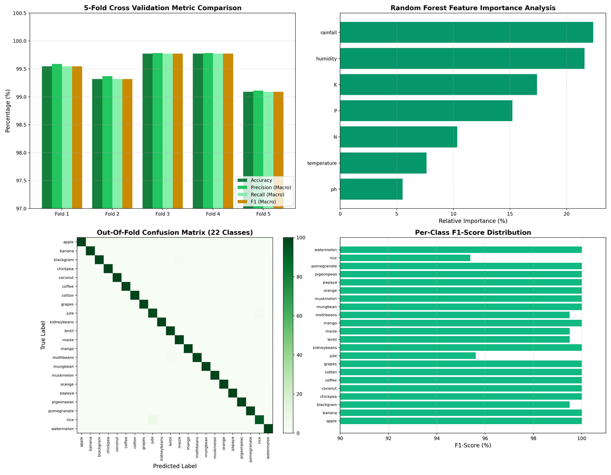
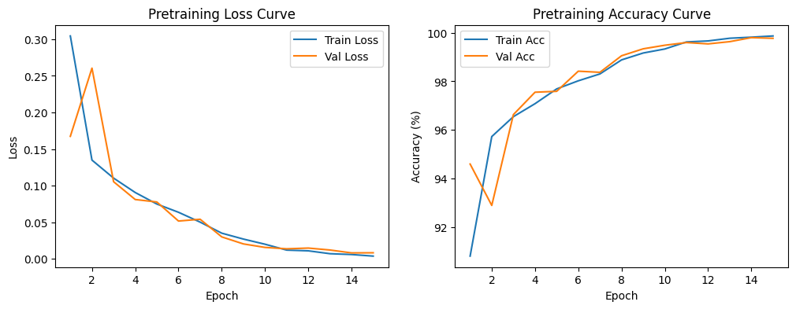

# ML-based Crop Recommendation and Plant Disease Detection

## Project Classification

| Parameter | Specification | Contextual Description |
|:---|:---|:---|
| **Project Title** | **ML-based Crop Recommendation and Plant Disease Detection** | End-to-end intelligent agricultural decision support system unifying soil chemistry analysis with computer vision leaf pathology diagnostics. |
| **Project Category / Domain** | **Agriculture Technology (AgTech)** | Applied Artificial Intelligence, Deep Learning, and Precision Agronomy. |
| **Geographic Scope (LRNG)** | **Regional Needs (State / Province Level)** | Designed specifically for regional agro-climatic zones, addressing localized soil nutrient profiles (N, P, K, pH) and regional plant pathologies across farming belts in India. |
| **Cross-Cutting Issues (CC)** | **Sustainability & Environment** | Prevents chemical degradation of arable land by computing optimal site-specific fertilizer requirements; minimizes broad-spectrum toxic pesticide runoff by enabling early-stage targeted disease identification. |
| **UN Sustainable Development Goal (SDG)** | **SDG 2: Zero Hunger (Target 2.4)** | *"Ensure sustainable food production systems and implement resilient agricultural practices that increase productivity and production, and improve land and soil quality."* |

---

## Executive Summary

**ML-based Crop Recommendation and Plant Disease Detection** addresses two of the most critical challenges faced by agricultural producers: selecting the most suitable crop for specific soil chemistry and diagnosing foliar diseases before they trigger devastating harvest losses.

The platform unifies two specialized machine learning systems:
1. **Crop Recommendation System**: Multi-parameter soil nutrient and meteorological intelligence powered by a 5-Fold Stratified Cross-Validated Random Forest Classifier (**99.50% Mean Accuracy** across 22 crop classes).
2. **Plant Leaf Pathology Diagnostic System**: Computer vision disease classification pipeline utilizing a Two-Stage Transfer Learning architecture (MobileNetV3-Large pretrained on PlantVillage at **99.59% accuracy**, fine-tuned on PlantDoc real-world field conditions with structured agronomic treatment protocols).

---

## Alignment with UN SDG 2 (Zero Hunger) & Regional Sustainability

```
+-----------------------------------------------------------------------------------+
|                        UN SDG 2: ZERO HUNGER (Target 2.4)                         |
|      "By 2030, ensure sustainable food production systems and implement           |
|       resilient agricultural practices that increase productivity"                |
+-----------------------------------------+-----------------------------------------+
                                          |
                +-------------------------+-------------------------+
                |                                                   |
                v                                                   v
+-------------------------------+                   +-------------------------------+
|  Precision Soil Intelligence  |                   |  Targeted Pathology Defense   |
|  - Balanced N-P-K management  |                   |  - Rapid disease detection    |
|  - Prevents soil degradation  |                   |  - Prevents total crop loss   |
|  - Optimized crop-soil match  |                   |  - Minimizes chemical runoff  |
+-------------------------------+                   +-------------------------------+
                |                                                   |
                +-------------------------+-------------------------+
                                          |
                                          v
+-----------------------------------------------------------------------------------+
|               Regional Sustainability & Environmental Conservation                |
|    - Enhanced harvest yields for regional farming communities                     |
|    - Reduced input costs via site-specific fertilizer application                 |
|    - Organic & chemical dual-tier treatment protocols for eco-friendly farming     |
+-----------------------------------------------------------------------------------+
```

---

## System Architecture

```
                                  +-----------------------------+
                                  |   Unified Flask Dashboard   |
                                  |   (templates/index.html)    |
                                  +--------------+--------------+
                                                 |
                       +-------------------------+-------------------------+
                       |                                                   |
                       v                                                   v
        +------------------------------+                    +------------------------------+
        |   Crop Recommendation Mode   |                    |    Leaf Pathology Clinic     |
        +--------------+---------------+                    +--------------+---------------+
                       |                                                   |
                       v                                                   v
        +------------------------------+                    +------------------------------+
        | Inputs: N, P, K, pH, Temp,   |                    | Inputs: Leaf Image           |
        | Humidity, Rainfall (7 Feats) |                    | (Upload, Drag-Drop, Webcam)  |
        +--------------+---------------+                    +--------------+---------------+
                       |                                                   |
                       v                                                   v
        +------------------------------+                    +------------------------------+
        | StandardScaler Normalization |                    | Albumentations RGB Transform |
        +--------------+---------------+                    +--------------+---------------+
                       |                                                   |
                       v                                                   v
        +------------------------------+                    +------------------------------+
        | Random Forest (300 Trees)    |                    | MobileNetV3-Large            |
        | weights/crop_model_final.pkl |                    | leaf_disease_model_final.pth |
        +--------------+---------------+                    +--------------+---------------+
                       |                                                   |
                       v                                                   v
        +------------------------------+                    +------------------------------+
        | Top-3 Cultivars + Confidence |                    | Top-3 Diagnosis + Confidence |
        +------------------------------+                    +--------------+---------------+
                                                                           |
                                                                           v
                                                            +------------------------------+
                                                            | Agronomic Knowledge Base     |
                                                            | Symptoms, Causes, Prevention |
                                                            | Chemical & Organic Controls  |
                                                            +------------------------------+
```

---

## Source Architecture & Deep-Dive (`src/` Directory Breakdown)

Every module in the `src/` directory has been modularly decoupled to maintain clean separation of concerns, reproducibility, and enterprise extensibility:

```
src/
├── crop/                              # Crop Recommendation Subsystem
│   ├── __init__.py
│   └── crop_recommendation.py         # Tabular data preprocessor, benchmark benchmarks, and inference logic
│
└── disease/                           # Computer Vision Pathology Subsystem
    ├── __init__.py
    ├── class_mapping.py               # Canonical taxonomy mapping bridging PlantVillage and PlantDoc datasets
    ├── dataset.py                     # Custom PyTorch Dataset loaders with Albumentations augmentation pipeline
    ├── model.py                       # Modular model architecture builders (MobileNetV3, EfficientNet, ResNet)
    ├── disease_info.py                # Agronomic knowledge base (pathogens, symptoms, chemical & organic remedies)
    ├── disease_predictor.py           # High-performance production inference engine
    └── test_disease.py                # Standalone CLI diagnostic test utility for images and batch folders
```

### Detailed Analysis of Source Files and Design Rationale

1. **`src/disease/class_mapping.py`**:
   - **Why it was added**: Laboratory datasets (PlantVillage) and real-world field datasets (PlantDoc) use completely disparate folder structures, naming conventions, and taxonomic syntax (for example: `Tomato___Tomato_Yellow_Leaf_Curl_Virus` in PlantVillage vs `Tomato leaf yellow virus` in PlantDoc). Without a centralized mapping, transfer learning weights cannot be dynamically mapped or validated across stages.
   - **How Mapping Works**:
     - Defines `PV_TO_UNIFIED` (38 classes) and `PD_TO_UNIFIED` (27 classes) dictionaries mapping raw folder names to unified canonical labels (e.g. `Tomato Yellow Leaf Curl Virus`).
     - Generates bidirectional integer encodings (`PV_CLASS_TO_IDX`, `PD_CLASS_TO_IDX`, `PV_IDX_TO_CLASS`, `PD_IDX_TO_CLASS`).
     - Provides `parse_class(label)` to dynamically decompose predictions into `(crop_name, is_healthy, disease_name)` tuples.
     - Ensures 100% taxonomic parity so that every target field class in Stage 2 has a corresponding pretrained feature extractor from Stage 1.

2. **`src/disease/model.py`**:
   - **Why it was added**: Provides a decoupled model factory that abstracts deep learning backbone architectures and enables seamless transfer learning head swapping.
   - **Key Capabilities**:
     - `build_model(num_classes, backbone='mobilenet_v3_large', pretrained_imagenet=True)`: Constructs MobileNetV3-Large, EfficientNet-B0, or ResNet-34 backbones with custom dropout and linear classification heads.
     - `load_stage1_and_swap_head(checkpoint_path, new_num_classes)`: Automatically loads 38-class Stage 1 weights and replaces the classifier head with a 27-class Stage 2 head while preserving all pretrained feature representations.
     - `freeze_backbone()` and `unfreeze_all()`: Facilitates 2-phase differential learning rate warmup.

3. **`src/disease/dataset.py`**:
   - **Why it was added**: Implements robust PyTorch data pipelines tailored for noisy real-world agricultural imagery and class imbalance.
   - **Key Capabilities**:
     - **Albumentations Augmentation Pipeline**: `RandomResizedCrop(224, 224)`, `HorizontalFlip`, `VerticalFlip`, `ColorJitter` (brightness, contrast, saturation), `ShiftScaleRotate`, and `CoarseDropout` (simulating occlusions and natural leaf damage).
     - **Class Imbalance Resolution**: Computes inverse-frequency sample weights (`get_sample_weights()`) enabling `WeightedRandomSampler` training so that underrepresented disease classes receive equal gradient representation during optimization.

4. **`src/disease/disease_info.py`**:
   - **Why it was added**: Standard computer vision models only output integer class IDs or labels. Real-world farmers and extension workers require actionable agronomic advice.
   - **Knowledge Base Details (`DISEASE_DB`)**:
     - Maps all 27 target classes to verified scientific data: biological pathogen taxonomy, visible symptoms, 3-5 prevention protocols, certified chemical fungicides, organic bio-controls, and severity index.

5. **`src/disease/disease_predictor.py`**:
   - **Why it was added**: Encapsulates model loading, GPU/CPU device dispatching, tensor transformation, and inference into a production-ready callable interface.
   - **Key Capabilities**:
     - Accepts image file paths or raw NumPy arrays.
     - Calculates Softmax probabilities and returns top-k ranked predictions.
     - Queries `disease_info.py` to package the diagnostic report and remedies directly into a structured dictionary for the Flask API.

6. **`src/disease/test_disease.py`**:
   - **Why it was added**: A dedicated CLI diagnostic tool allowing developers, researchers, and agronomists to evaluate models from the command line on individual leaf photos or entire directories in batch without launching the web server.

7. **`src/crop/crop_recommendation.py`**:
   - **Why it was added**: Houses the data processing routines, StandardScaler normalization, and baseline benchmarks for the 22-crop recommendation subsystem.

---

## Directory Structure

```
AgriML/
├── app.py                             # Unified Flask web application and REST API server
├── requirements.txt                   # Project package dependencies
├── LICENSE                            # MIT License
├── README.md                          # Comprehensive project documentation
│
├── dataset/                           # Dataset repository
│   ├── Crop Recommendation dataset.csv # 2,200 rows x 8 columns tabular dataset
│   └── PlantDoc-Dataset/              # Real-world field leaf pathology dataset
│   |   ├── train/                     # 2,310 field training images (27 classes)
│   |   └── test/                      # 242 field testing images
│   └── PlantVillage/                  # 54,305 lab images across 38 classes
│       ├── train/                     
│       └── val/                       
│
├── notebooks/                         # Interactive Jupyter training and evaluation notebooks
│   ├── Crop Recommendation.ipynb      # 5-Fold Stratified CV training with multi-metric analysis
│   ├── PlantVillage Pretraining.ipynb # Stage 1 pretraining on 54,305 lab images (38 classes)
│   └── PlantDoc 5 Fold FineTuning.ipynb # Stage 2 5-Fold Stratified fine-tuning (27 classes)
│
├── src/                               # Modular Python source codebase
│   ├── crop/                          # Crop recommendation engine
│   │   ├── __init__.py
│   │   └── crop_recommendation.py     # Crop recommendation core routines
│   │
│   └── disease/                       # Leaf pathology computer vision engine
│       ├── __init__.py
│       ├── class_mapping.py           # Taxonomy mapping (38 PV classes to 27 PD classes)
│       ├── dataset.py                 # PyTorch Dataset loaders with Albumentations transforms
│       ├── disease_info.py            # Agronomic knowledge base (remedies, pathogens, prevention)
│       ├── disease_predictor.py       # High-performance inference engine
│       ├── model.py                   # MobileNetV3, EfficientNet-B0, and ResNet-34 builders
│       └── test_disease.py            # Standalone CLI diagnostic test utility
│
├── templates/                         # User Interface Templates
│   └── index.html                     # Full command center (Day/Night themes, 22 tags, season cycle)
│
├── testing/                           # Independent external validation images (51 real-world photos)
│
├── docs/                              # Documentation and visual evaluation assets
│   ├── Crop Dashboard.png             # Screenshot of Crop Recommendation Interface
│   ├── Disease Dashboard.png          # Screenshot of Plant Leaf Diagnostic Interface
│   └── results/                       # High-resolution confusion matrices and training curves
│       ├── crop_metrics_plot.png      # 5-Fold CV metrics, feature importance & confusion matrix
│       └── Pretraining.png            # Stage 1 pretraining convergence curves
│
└── weights/                           # Exported model weights
    ├── crop_model_final.pkl           # 5-Fold CV Random Forest (99.50% accuracy)
    ├── leaf_disease_model_final.pth   # 5-Fold CV MobileNetV3-Large (60.34% accuracy)
    └── plantvillage_pretrained.pth    # Stage 1 Pretrained MobileNetV3-Large (99.59% accuracy)
```
Datasets Link: https://drive.google.com/drive/folders/1JA7zK4TUY3whnYB2bPlvOmruqnPhGxcs?usp=drive_link
---

## Module 1: Crop Recommendation System

### Dataset Specifications
- **Source**: `dataset/Crop Recommendation dataset.csv`
- **Total Samples**: 2,200 observations
- **Target Classes**: 22 balanced crop cultivars (100 samples each)
- **Input Features (7 continuous variables)**:
  1. `N`: Nitrogen ratio in soil (mg/kg)
  2. `P`: Phosphorus ratio in soil (mg/kg)
  3. `K`: Potassium ratio in soil (mg/kg)
  4. `temperature`: Ambient temperature in Celsius (deg C)
  5. `humidity`: Relative humidity in percentage (%)
  6. `ph`: Soil acidity index (0.0 to 14.0 pH)
  7. `rainfall`: Seasonal precipitation (mm)

### Supported Crop Classes (22)
*Apple, Banana, Blackgram, Chickpea, Coconut, Coffee, Cotton, Grapes, Jute, Kidneybeans, Lentil, Maize, Mango, Mothbeans, Mungbean, Muskmelon, Orange, Papaya, Pigeonpeas, Pomegranate, Rice, Watermelon.*

### Quantitative Multi-Metric Results (5-Fold Stratified Cross-Validation)

<div align="center">



*Figure 1: 5-Fold Cross-Validation Metric Comparison, Random Forest Feature Importance Analysis, Out-of-Fold Normalized Confusion Matrix, and Per-Class F1-Score Distribution.*

</div>

| Fold Number | Accuracy | Precision (Macro) | Recall (Macro) | F1-Score (Macro) | Cohen Kappa | Matthews Correlation (MCC) | Log Loss |
|:---:|:---:|:---:|:---:|:---:|:---:|:---:|:---:|
| **Fold 1** | 99.55% | 99.59% | 99.55% | 99.54% | 0.9952 | 0.9953 | 0.0514 |
| **Fold 2** | 99.32% | 99.37% | 99.32% | 99.32% | 0.9929 | 0.9929 | 0.0506 |
| **Fold 3** | 99.77% | 99.78% | 99.77% | 99.77% | 0.9976 | 0.9976 | 0.0501 |
| **Fold 4** | 99.77% | 99.78% | 99.77% | 99.77% | 0.9976 | 0.9976 | 0.0547 |
| **Fold 5** | 99.09% | 99.11% | 99.09% | 99.09% | 0.9905 | 0.9905 | 0.0523 |
| **Overall (Mean +/- Std)** | **99.50% (+/- 0.27%)** | **99.53% (+/- 0.28%)** | **99.50% (+/- 0.27%)** | **99.50% (+/- 0.27%)** | **0.9948 (+/- 0.003)** | **0.9948 (+/- 0.003)** | **0.0518 (+/- 0.002)** |

### Statistical Metrics Explained
- **Cohen Kappa (0.9948)**: Evaluates inter-rater agreement adjusted for random chance ($>0.90$ proves near-perfect agreement).
- **Matthews Correlation Coefficient (0.9948)**: Balanced score confirming robust multi-class separation across all 22 classes.
- **Log Loss (0.0518)**: Cross-entropy error confirming sharp, well-calibrated class probability estimations.

---

## Module 2: Plant Leaf Pathology Diagnostic System

### Two-Stage Transfer Learning Pipeline
```
[ImageNet-1K V2 Weights]
          |
          v
[Stage 1: PlantVillage Pretraining]
54,305 Lab Images (38 Classes)
Validation Accuracy: 99.59% | Loss: 0.0136
          |
          v (Preserve Learned Feature Extractors)
[Stage 2: PlantDoc 5-Fold Stratified Fine-Tuning]
2,552 Field Images (27 Classes, 13 Species)
Warmup Phase + Differential Learning Rates
5-Fold CV Field Accuracy: 60.34% (+/- 1.64%) | Top-3 Accuracy: 88.14%
```

### Stage 1 (Pretraining on Laboratory Dataset)

<div align="center">



*Figure 2: MobileNetV3-Large Stage 1 Pretraining Convergence Curves (Training Loss, Validation Accuracy, and Cross-Entropy Optimization on 54,305 Images).*

</div>

- **Dataset**: PlantVillage (54,305 lab images across 38 classes).
- **Backbone**: MobileNetV3-Large initialized with ImageNet-1K V2 weights.
- **Optimization**: AdamW (`lr=1e-3, weight_decay=1e-4`) with CosineAnnealingLR.
- **Result**: **99.59% Validation Accuracy** (Loss: 0.0136). Saved at `weights/plantvillage_pretrained.pth`.

### Stage 2 (Fine-Tuning on Real-World Field Benchmark)
- **Dataset**: PlantDoc Dataset (2,552 real-world field photos across 27 classes, 13 plant species).
- **Strategy**: 2-phase warmup with differential learning rates (Backbone: $1\times 10^{-4}$, Head: $1\times 10^{-3}$) and class-balanced weighted random sampling.
- **Result**: **60.34% (± 1.64%)** Mean 5-Fold CV Accuracy, **88.14%** Top-3 Retrieval Accuracy (16.6x higher than random chance). Saved at `weights/leaf_disease_model_final.pth`.

### Supported Plant Pathology Classes (27)

| Number | Plant Species | Condition / Disease Label | Pathogen / Cause | Severity Index | Status |
|:---:|:---|:---|:---|:---:|:---:|
| 1 | Apple | Apple Scab | *Venturia inaequalis* | Medium | Diseased |
| 2 | Apple | Apple Cedar Rust | *Gymnosporangium juniperi-virginianae* | Medium | Diseased |
| 3 | Apple | Apple Healthy | Normal Foliage | Low | Healthy |
| 4 | Bell Pepper | Bell Pepper Bacterial Spot | *Xanthomonas campestris pv. vesicatoria* | High | Diseased |
| 5 | Bell Pepper | Bell Pepper Healthy | Normal Foliage | Low | Healthy |
| 6 | Blueberry | Blueberry Healthy | Normal Foliage | Low | Healthy |
| 7 | Cherry | Cherry Healthy | Normal Foliage | Low | Healthy |
| 8 | Corn | Corn Gray Leaf Spot | *Cercospora zeae-maydis* | High | Diseased |
| 9 | Corn | Corn Common Rust | *Puccinia sorghi* | Medium | Diseased |
| 10 | Corn | Corn Northern Leaf Blight | *Exserohilum turcicum* | High | Diseased |
| 11 | Grape | Grape Black Rot | *Guignardia bidwellii* | High | Diseased |
| 12 | Grape | Grape Healthy | Normal Foliage | Low | Healthy |
| 13 | Peach | Peach Healthy | Normal Foliage | Low | Healthy |
| 14 | Potato | Potato Early Blight | *Alternaria solani* | Medium | Diseased |
| 15 | Potato | Potato Late Blight | *Phytophthora infestans* | High | Diseased |
| 16 | Raspberry | Raspberry Healthy | Normal Foliage | Low | Healthy |
| 17 | Soybean | Soybean Healthy | Normal Foliage | Low | Healthy |
| 18 | Squash | Squash Powdery Mildew | *Podosphaera xanthii* | Medium | Diseased |
| 19 | Strawberry | Strawberry Healthy | Normal Foliage | Low | Healthy |
| 20 | Tomato | Tomato Bacterial Spot | *Xanthomonas perforans* | High | Diseased |
| 21 | Tomato | Tomato Early Blight | *Alternaria linariae* | Medium | Diseased |
| 22 | Tomato | Tomato Late Blight | *Phytophthora infestans* | High | Diseased |
| 23 | Tomato | Tomato Leaf Mold | *Passalora fulva* | Medium | Diseased |
| 24 | Tomato | Tomato Septoria Leaf Spot | *Septoria lycopersici* | Medium | Diseased |
| 25 | Tomato | Tomato Mosaic Virus | *Tobacco Mosaic Virus (TMV)* | High | Diseased |
| 26 | Tomato | Tomato Yellow Leaf Curl Virus | *Begomovirus (TYLCV)* | High | Diseased |
| 27 | Tomato | Tomato Healthy | Normal Foliage | Low | Healthy |

---

## Web Dashboard Features

### Live Dashboard Interface

| Soil Nutrient & Crop Recommendation Interface | Leaf Pathology Diagnostic Interface |
|:---:|:---:|
|  |  |

- **Theme Toggle**: Switch between **Day Theme** (Parchment, Wheat, and Leaf) and **Night Theme** (Deep Soil and Moonlit Emerald) with `localStorage` persistence and automatic system preference detection.
- **2-Minute Rotating Seasonal Cycle**: Dynamic crossfading cycle between **Kharif** (June to October), **Rabi** (November to March), and **Zaid** (March to May) synchronized across the hero header and sidebar almanac.
- **22 Interactive Demonstrator Tags**: Instant one-click population of soil and climate parameters for all 22 crop types based on dataset distributions.
- **Live Vision Scanner**: Drag-and-drop file upload, benchmark sample selectors, and integrated WebRTC camera frame capture.
- **Agronomic Knowledge Hub**: Clinical pathology reports with dedicated tabs for Symptoms & Causes, Prevention Protocols, Chemical Sprays, and Organic Bio-controls.
- **Model Benchmarks & Specs View**: Dedicated telemetry hub presenting full model parameters, cross-validation metrics, and Cohen's Kappa explanations.

---

## Installation & Usage Guide

### 1. Environment Setup

```powershell
git clone https://github.com/YourRepo/AgriML.git
cd AgriML
pip install -r requirements.txt
```

### 2. Launch the Unified Web Command Center

```powershell
python app.py
```
Navigate to: **http://localhost:5000** in your web browser.

### 3. Run Interactive Training Notebooks

Launch Jupyter Notebook:
```powershell
jupyter notebook
```
- `notebooks/Crop Recommendation.ipynb`: 5-Fold Stratified CV training with multi-metric analysis.
- `notebooks/PlantVillage Pretraining.ipynb`: Stage 1 pretraining on 54,305 lab images.
- `notebooks/PlantDoc 5 Fold FineTuning.ipynb`: Stage 2 5-Fold fine-tuning on field pathology images.

### 4. Run CLI Diagnostic Tester

Diagnose a single leaf photo:
```powershell
python src/disease/test_disease.py --image "testing/Tomato_Early_Blight_2.jpg"
```

Diagnose an entire folder in batch:
```powershell
python src/disease/test_disease.py --batch-dir "testing"
```

### 5. CLI Batch Evaluation Output (51 External Test Images)

```
Evaluating batch of 51 images from: testing

Image File                       | Predicted Class              | Status     | Confidence
----------------------------------------------------------------------------------------
Apple_Cedar_Rust_1.jpg           | Tomato Yellow Leaf Curl Vi   |  Diseased  |  69.32%
Apple_Cedar_Rust_2.jpg           | Apple Cedar Rust             |  Diseased  |  18.21%
Apple_Healthy_1.jpg              | Corn Northern Leaf Blight    |  Diseased  |  28.68%
Apple_Healthy_2.jpg              | Apple Cedar Rust             |  Diseased  |  42.62%
Apple_Scab_1.jpg                 | Corn Northern Leaf Blight    |  Diseased  |  30.47%
Apple_Scab_2.jpg                 | Apple Scab                   |  Diseased  |  78.83%
Apple_leaf.jpg                   | Blueberry Healthy            |  Healthy   |  43.43%
Apple_rust_leaf.jpg              | Apple Scab                   |  Diseased  |  39.81%
Bell_Pepper_Bacterial_Spot_1.j   | Potato Early Blight          |  Diseased  |  57.21%
Bell_Pepper_Bacterial_Spot_2.j   | Potato Early Blight          |  Diseased  |  57.21%
Bell_Pepper_Healthy_2.jpg        | Bell Pepper Healthy          |  Healthy   |  61.69%
Bell_pepper_leaf.jpg             | Bell Pepper Healthy          |  Healthy   |  99.18%
Bell_pepper_leaf_spot.jpg        | Bell Pepper Bacterial Spot   |  Diseased  |  53.28%
Blueberry_leaf.jpg               | Blueberry Healthy            |  Healthy   |  96.78%
Cherry_leaf.jpg                  | Cherry Healthy               |  Healthy   |  99.20%
Corn_Common_Rust_2.jpg           | Squash Powdery Mildew        |  Diseased  |  69.74%
Corn_Gray_Leaf_Spot_1.jpg        | Cherry Healthy               |  Healthy   |  30.56%
Corn_Gray_leaf_spot.jpg          | Corn Gray Leaf Spot          |  Diseased  |  46.17%
Corn_Northern_Leaf_Blight_1.jp   | Corn Gray Leaf Spot          |  Diseased  |  33.87%
Corn_Northern_Leaf_Blight_2.jp   | Corn Northern Leaf Blight    |  Diseased  |  27.11%
Corn_leaf_blight.jpg             | Corn Northern Leaf Blight    |  Diseased  |  94.46%
Corn_rust_leaf.jpg               | Corn Common Rust             |  Diseased  |  97.69%
Grape_Black_Rot_1.jpg            | Grape Black Rot              |  Diseased  |  75.00%
Grape_Black_Rot_2.jpg            | Grape Black Rot              |  Diseased  |  68.27%
Grape_Healthy_1.jpg              | Corn Gray Leaf Spot          |  Diseased  |  27.66%
Grape_Healthy_2.jpg              | Corn Northern Leaf Blight    |  Diseased  |  35.02%
Peach_leaf.jpg                   | Cherry Healthy               |  Healthy   |  29.47%
Potato_Early_Blight_2.png        | Corn Northern Leaf Blight    |  Diseased  |  64.50%
Potato_Healthy_1.jpg             | Squash Powdery Mildew        |  Diseased  |  61.34%
Potato_Healthy_2.jpg             | Soybean Healthy              |  Healthy   |  33.88%
Potato_Late_Blight_1.jpg         | Potato Early Blight          |  Diseased  |  59.19%
Potato_Late_Blight_2.jpg         | Corn Northern Leaf Blight    |  Diseased  |  20.16%
Potato_leaf_early_blight.jpg     | Potato Early Blight          |  Diseased  |  43.73%
Potato_leaf_late_blight.jpg      | Potato Late Blight           |  Diseased  |  61.77%
Raspberry_leaf.jpg               | Raspberry Healthy            |  Healthy   |  94.07%
Squash_Powdery_Mildew_1.jpg      | Tomato Late Blight           |  Diseased  |  21.40%
Strawberry_Healthy_1.jpg         | Strawberry Healthy           |  Healthy   |  76.28%
Strawberry_Healthy_2.jpg         | Strawberry Healthy           |  Healthy   |  98.74%
Tomato_Early_Blight_1.jpg        | Tomato Late Blight           |  Diseased  |  85.67%
Tomato_Early_Blight_2.jpg        | Tomato Late Blight           |  Diseased  |  85.67%
Tomato_Healthy_1.jpg             | Tomato Healthy               |  Healthy   |  67.21%
Tomato_Healthy_2.jpg             | Blueberry Healthy            |  Healthy   |  78.10%
Tomato_Late_Blight_1.jpg         | Tomato Late Blight           |  Diseased  |  14.58%
Tomato_Late_Blight_2.jpg         | Tomato Late Blight           |  Diseased  |  51.18%
Tomato_Mosaic_Virus_1.jpg        | Tomato Early Blight          |  Diseased  |  35.01%
Tomato_Septoria_Leaf_Spot.jpg    | Tomato Septoria Leaf Spot    |  Diseased  |  30.73%
Tomato_Septoria_Leaf_Spot_1.jp   | Apple Scab                   |  Diseased  |  31.38%
Tomato_Septoria_Leaf_Spot_2.jp   | Tomato Septoria Leaf Spot    |  Diseased  |  42.76%
Tomato_leaf_late_blight.jpg      | Tomato Late Blight           |  Diseased  |  98.93%
Tomato_leaf_mosaic_virus.jpg     | Tomato Mosaic Virus          |  Diseased  |  73.45%
Tomato_leaf_yellow_virus.jpg     | Tomato Yellow Leaf Curl Vi   |  Diseased  |  94.76%
----------------------------------------------------------------------------------------
```

---

## API Reference

The Flask backend exposes the following REST endpoints:

### `POST /api/recommend_crop`
Predicts optimal crop cultivar given 7 soil and climate inputs.

**Request Payload**:
```json
{
  "N": 90.0,
  "P": 42.0,
  "K": 43.0,
  "ph": 6.5,
  "temperature": 25.0,
  "humidity": 80.0,
  "rainfall": 200.0,
  "manual_override": true
}
```

**Response Payload**:
```json
{
  "status": "ok",
  "recommended_crop": "rice",
  "top_3": [
    { "crop": "rice", "confidence": 51.0 },
    { "crop": "jute", "confidence": 49.0 },
    { "crop": "pomegranate", "confidence": 0.0 }
  ],
  "timestamp": "2026-08-23 21:05:30"
}
```

---

### `POST /api/predict_disease`
Diagnoses plant leaf disease from an uploaded image file.

**Request**: `multipart/form-data` with `image` file field.

**Response Payload**:
```json
{
  "status": "ok",
  "predicted_class": "Tomato Late Blight",
  "confidence": 94.7,
  "crop": "Tomato",
  "disease": "Late Blight",
  "is_healthy": false,
  "top_k": [
    { "class_name": "Tomato Late Blight", "confidence": 94.7 },
    { "class_name": "Potato Late Blight", "confidence": 3.2 },
    { "class_name": "Tomato Early Blight", "confidence": 1.1 }
  ],
  "disease_info": {
    "crop": "Tomato",
    "disease": "Late Blight",
    "is_healthy": false,
    "symptoms": "Large, irregular water-soaked lesions on leaves and dark brown lesions on stems.",
    "causes": "Phytophthora infestans (oomycete pathogen) favored by cool, wet weather.",
    "prevention": [
      "Plant certified disease-free seed and resistant cultivars.",
      "Avoid overhead watering; maintain good plant spacing for airflow.",
      "Rotate crops away from solanaceous species for at least 3 years."
    ],
    "chemical_treatment": [
      "Chlorothalonil or Mancozeb as preventive protectant sprays.",
      "Metalaxyl/Mefenoxam or Dimethomorph for curative intervention."
    ],
    "organic_treatment": [
      "Copper octanoate fungicide sprays.",
      "Bacillus subtilis bio-fungicide applications."
    ],
    "severity": "High"
  }
}
```

---

### `GET /api/sample_image?class=<ClassName>`
Returns a benchmark test image corresponding to a requested target class name.

---

## License

This project is licensed under the MIT License - see the [LICENSE](LICENSE) file for details.\n
